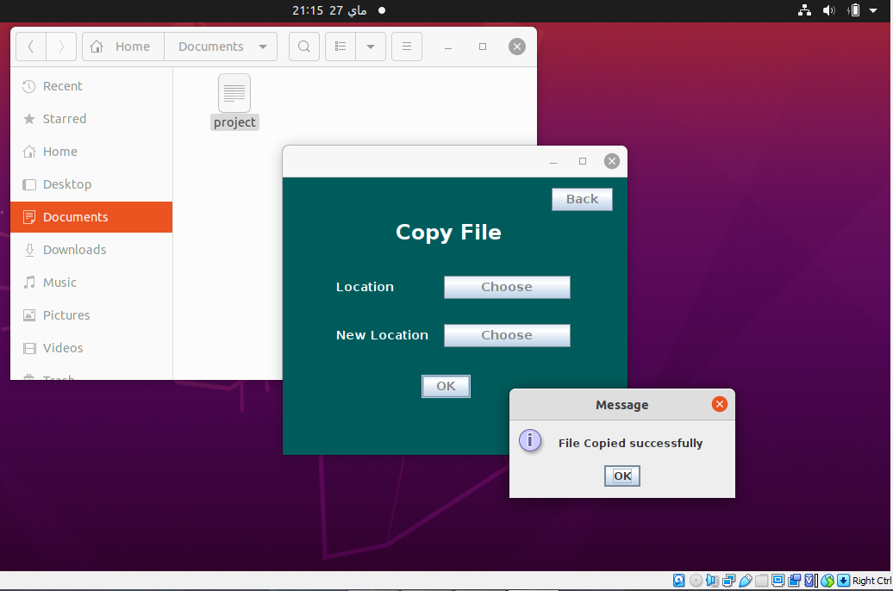

<h1> File Manager</h1>

File Manager is a simple Linux Ubuntu project, using  **Java, Linux Commands, OOP and design Patterns Concepts.**
  

<h1> Description </h1>
File Manager provides a user interface to manage files and directories and simulates the terminal in Ubuntu Linux.
user can:

  - Create Files and Directories
  - Copy Files and Directories
  - Move Files and Directories
  - Delete Files and Directories
  - List Files and Directories
 

<h1> Prerequisites </h1>

- Install Netbeans

 

<h1>Getting into the project</h1>

**<h2> Home page </h2>** 
- The user can choose from multiple options on the Home page
 

 

**<h2> Create File </h2>** 

  

**<h2> Copy File</h2>** 

  

**<h2> Delete File </h2>** 

  

**<h2>Move File</h2>** 

  

**<h2>List File & directory </h2>** 

  

<h1>Other Screenshots</h1>

**
Create Directory 
**

  

**
Delete Directory
**

  

 

**
Move Directory
**

  

**
Copy Directory 
**

  

 

